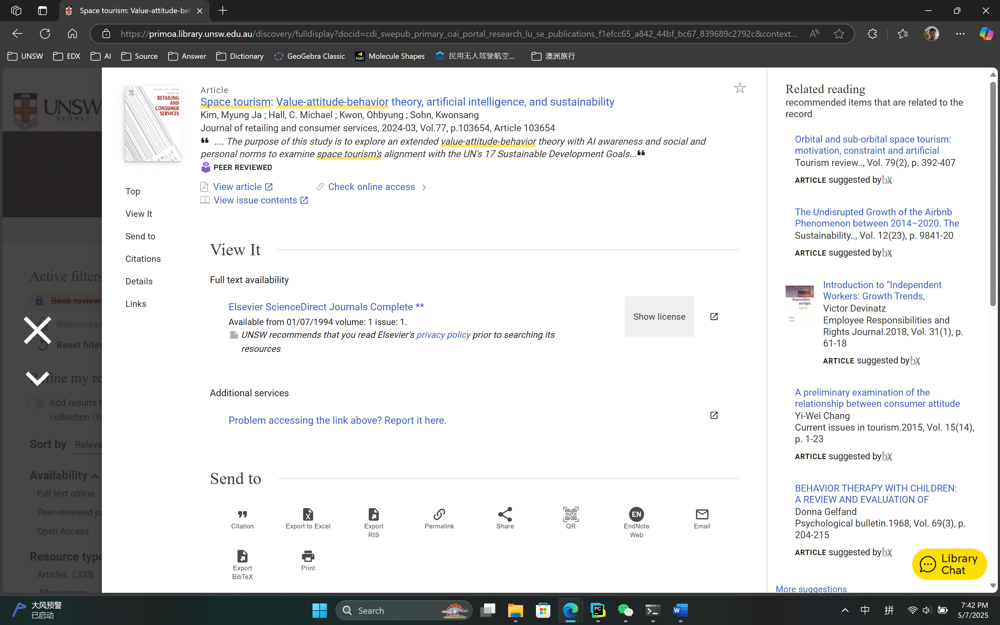

# Harvard Reference Generator

***Be careful! This website is built to generate harvard reference according to the UNSW standard, more information at <https://www.student.unsw.edu.au/citing-different-sources>***

## Usage Guide
1. Visit UNSW Library and find your desired answer

2. Scroll down the page to find `Detail` part

3. Copy the whole part

4. Paste it into the generator and simply click the button
